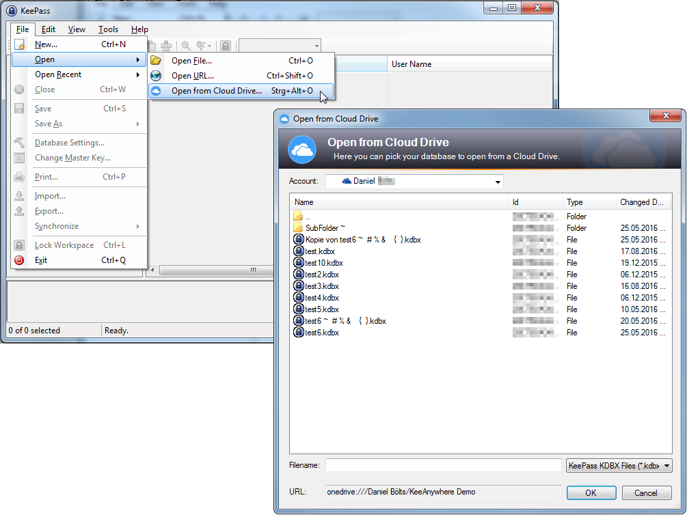

KeeAnywhere is a [KeePass Password Safe](http://keepass.info) plugin that provides access to cloud storage providers (cloud drives). The main goal is to offer a simple UI while integrating deeply into KeePass. This covers all kind of users: novices, experienced and power users.

# Supported providers (in alphabetical order):
* Amazon Drive (Experimental: see reason [here](use/known_issues))
* Amazon AWS S3
* Box
* Dropbox
* Google Drive
* HiDrive 
* hubiC 
* OneDrive  

# Key features
* Support for multiple cloud storage providers
* Support for multiple accounts for each cloud storage provider
* Open/Save databases with a feature rich user interface
* Easy and intuitive configuration
* Access to cloud stored databases via URL ("Open from URL"/"Save to URL")
* Full support of recent files list
* Deep integration into KeePass' core functions (synchroniziation, triggers, scripting, etc.)
* No need for technical configuration entries in a database
* No need to have cloud storage provider's native client be installed
* Proxy support
* Simple Automatic Backup
* Offline Caching

# License
The source code is licensed under the [MIT license](https://github.com/Kyrodan/KeeAnywhere/blob/master/LICENSE).